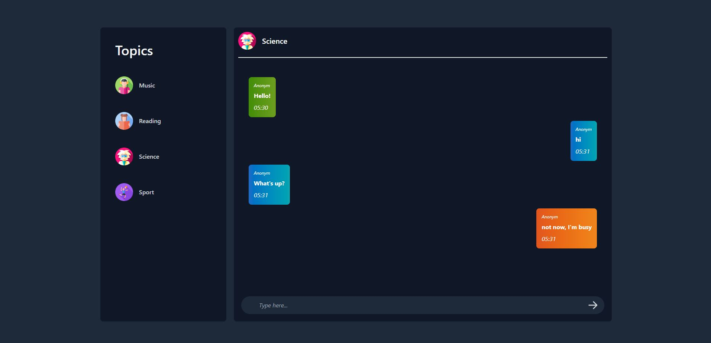

## Real-time chat application

### Overview

Website offers chat rooms with various topics for communication, where users can connect.

- Green message - positive sentiment
- Blue message - neutral sentiment
- Orange message - negative sentiment

### Application structure

- src:
  - backend:
    - **RealTimeChat.Domain** - Domain layer. Contains entities and repository interfaces.
    - **RealTimeChat.Application** - Application layer. Contains use cases.
    - **RealTimeChat.Infrastructure** - Infrastructure Layer. Contains implementations to external resources.
    - **RealTimeChat.Api** - ASP.NET Core project. Сontains endpoints.
  - frontend:
    - **RealTimeChat.Blazor** - Blazor Wasm project. Сontains page components.
  - shared:
    - **RealTimeChat.Shared** - Shared resources.
- tests:
  - **RealTimeChat.Application.UnitTests** - Unit tests for use cases.

### Technology stack

- ASP.NET Core - for backend-side
- SQL Server - application database
- EF Core - to interact with the database
- MediatR - to implement commands and queries
- FluentValidation - to implement validation
- FluentResult - to implement result pattern
- Azure.AI.TextAnalytics - to integrate sentiment analysis
- Asp.Versioning.Http - to implement api versioning.
- Scalar.AspNetCore - to implement UI for OpenApi.
- Microsoft.Azure.SignalR - to interact with Azure SignalR Service.
---
- Blazor WASM - for client-side
- Tailwind CSS - for styles
- Microsoft.AspNetCore.SignalR.Client - to interact with SignalR on the client side 
---
- XUnit - to test application
- NSubstitute - for mocking
- FluentAssertions - to use some extensions methods for testing
- Coverlet.msbuild - for code coverage

### Code coverage

**RealTimeChat.Application.UnitTests** contains code coverage file - *coverage.cobertura.xml* (percent - 84)

